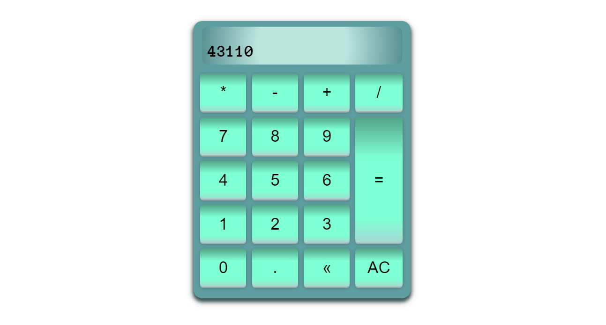
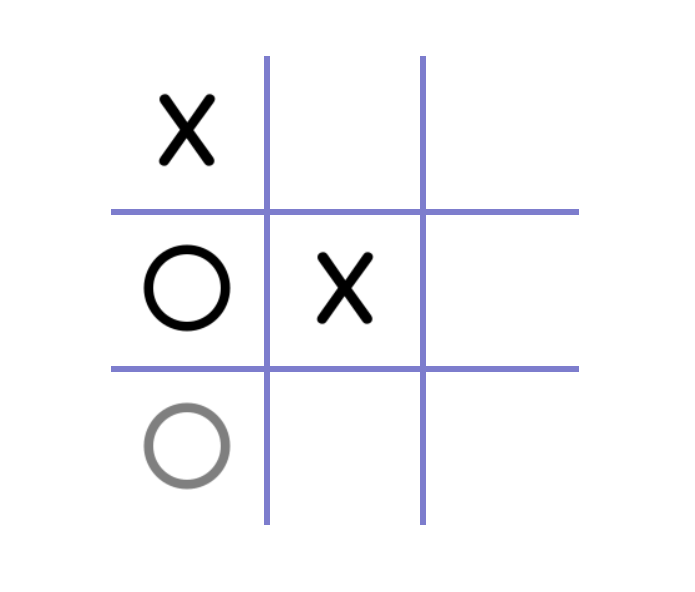

<h1><strong>Vanilla JS Projects</strong></h1>

This repo is composed of vanilla JavaScript projects.  All projects were developed with JavaScript, SCSS and HTML5.  The SCSS file is attached for easier viewing.  To fork a project, it will need to be converted to CSS, or the environment will need a CSS preprocessor.

![last commit][last-commit]
![repo size][repo-size]
![language count][language-count]
![main language][main-language]

 

## <strong>Project Previews, Links and Details</strong>

 

### <strong>Calculator</strong>

[Working demo of calculator](https://codepen.io/alleycaaat/full/zYmKQEz)
- allows for keyboard use
- switch case statements to keep code cleaner
- hover effects mimic pressing down on a real button
- backspace to remove individual character from display
- AC to clear everything
- ternary operator to add a zero before a decimal if the number is less than one

 

### <strong>tic-tac-toe</strong>

[Working demo of tic-tac-toe](https://codepen.io/alleycaaat/full/NWONQOK)
- user can hover over empty boxes to see potential moves
- gameboard built with for loops
- gameboard boxes have aria-labels of x and y coordinates
- dynamically displays winner at games end
- if no winner, winning message displays draw
- forEach loop, classList property and ternary operators utilized

 

(<a href='#top'>back to top</a>)

## <strong>Contact</strong>

AC Hulslander - [Send me a message](https://www.achulslander.com/#contact)

[![GitHub][github]](https://github.com/alleycaaat/)
[![linkedin][linkedin]][linkedin-url]
[![hashnode][hashnode]][hashnode-url]
[![discord][discord]][discord-url]
[![codepen][codepen]][codepen-url]
[![twitter][twitter]][twitter-url]

(<a href='#top'>back to top</a>)

[issues-open]: https://img.shields.io/github/issues/alleycaaat/vanilla-JS-projects?color=blue&logo=github

[repo-size]: https://img.shields.io/github/repo-size/alleycaaat/vanilla-JS-projects?color=red&logo=github

[language-count]: https://img.shields.io/github/languages/count/alleycaaat/vanilla-JS-projects?color=orange&logo=github

[main-language]: https://img.shields.io/github/languages/top/alleycaaat/vanilla-JS-projects?color=yellow&logo=github

[last-commit]: https://img.shields.io/github/last-commit/alleycaaat/vanilla-JS-projects?logo=github

[linkedin]: https://img.shields.io/badge/-LinkedIn-black.svg?style=for-the-badge&logo=linkedin&colorB=555
[linkedin-url]: https://linkedin.com/in/achulslander

[github]: https://img.shields.io/badge/GitHub-100000?style=for-the-badge&logo=github&logoColor=white

[codepen]: https://img.shields.io/badge/Codepen-000000?style=for-the-badge&logo=codepen&logoColor=white
[codepen-url]: https://codepen.io/alleycaaat

[twitter]: https://img.shields.io/badge/Twitter-1DA1F2?style=for-the-badge&logo=twitter&logoColor=white
[twitter-url]: https://twitter.com/achulslander

[hashnode]: https://img.shields.io/badge/Hashnode-2962FF?style=for-the-badge&logo=hashnode&logoColor=white
[hashnode-url]: https://hashnode.com/@alleycaaat

[discord]:https://img.shields.io/badge/Discord-7289DA?style=for-the-badge&logo=discord&logoColor=white
[discord-url]: https://discordapp.come/users/427569685366833174
