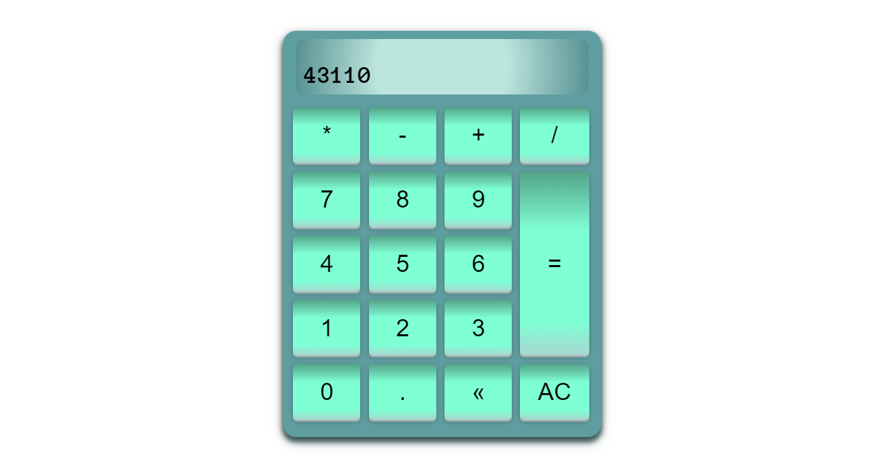

# <strong>Calculator</strong>

[Working demo of calculator](https://codepen.io/alleycaaat/full/zYmKQEz)
- allows for keyboard use
- switch case statements to keep code cleaner
- hover effects mimic pressing down on a real button
- backspace to remove individual character from display
- AC to clear everything
- ternary operator to add a zero before a decimal if the number is less than one

