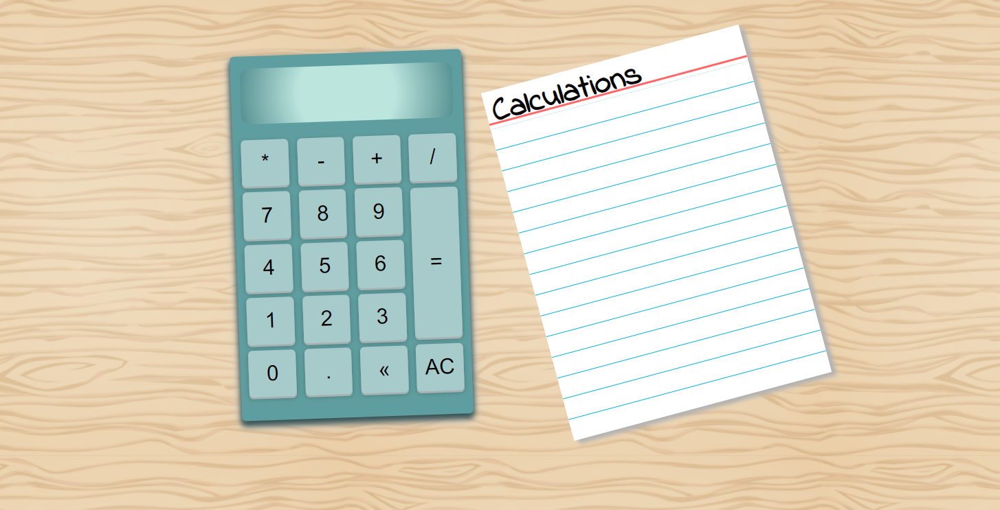

# <strong>Desktop Calculator</strong>

[Working demo of calculator](https://codepen.io/alleycaaat/full/ZEqBXWb)
- allows for keyboard use or mouseclicks
- on large screens, shows the calculation history on a slice of paper
- multiple switch case statements keep code cleaner
- hover effects mimic pressing down on a real button
- backspace to remove individual character from display
- AC button to clear calculator display
- ternary operator to add a zero before a decimal if the number is less than one
- original background image by [macrovector](https://www.freepik.com/free-vector/wood-vector-texture-template-pattern-seamless-material-hardwood-floor-natural-light-parquet-vector-illustration_11059494.htm#query=seamless%20wood%20texture&position=0&from_view=keyword&track=ais)