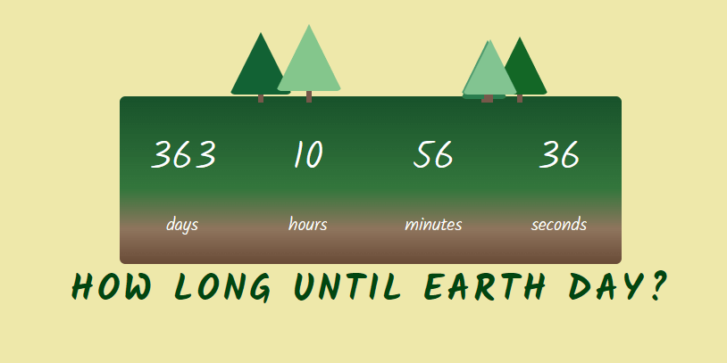

# <strong>Earth Day Countdown</strong>

[Working demo of the countdown](https://codepen.io/alleycaaat/full/BaqWwwP)
- timer updates every second to display how long until Earth Day, 22 April
- a forst of little trees is dynamically built on each render
- displayed message changes on Earth Day
- trees are built then appended to the parent element
- Math.random generates a height, z-index,0 margin and left values for each tree
- Colors are randomly selected from an array of 15 options
