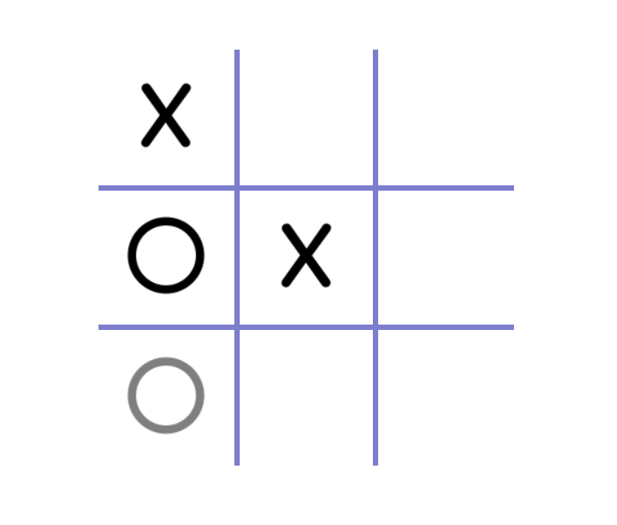
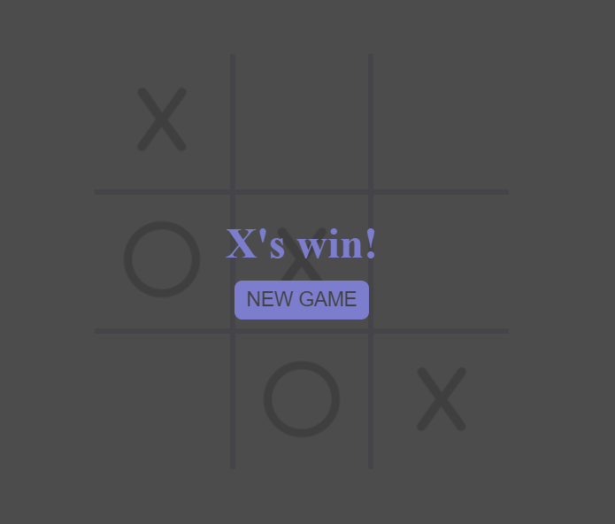

# <strong>tic-tac-toe</strong>
[Working demo of tic-tac-toe](https://codepen.io/alleycaaat/full/NWONQOK)
- user can hover over empty boxes to see potential moves
- gameboard built with for loops
- gameboard boxes have aria-labels of x and y coordinates
- dynamically displays winner at games end
- if no winner, winning message displays draw
- forEach loop, classList property and ternary operators utilized

